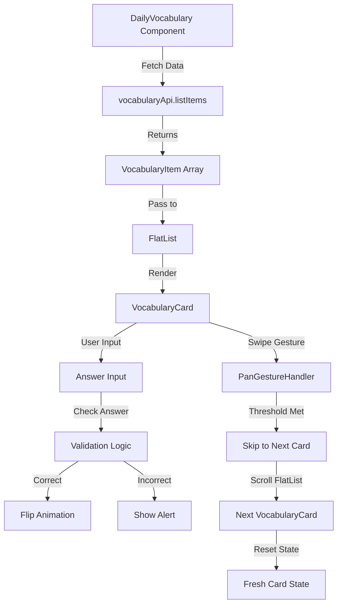
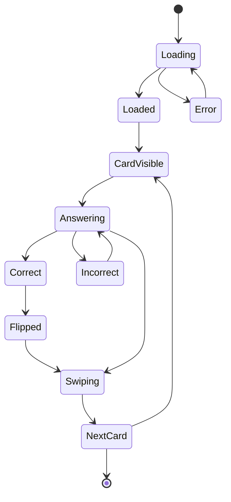

# Swipeable Card Architecture for Daily Vocabulary Component

## Overview

This document outlines the technical design for refactoring the [`daily-vocabulary.tsx`](components/daily-vocabulary.tsx) component to implement a swipeable card interface using FlatList, react-native-reanimated, and react-native-gesture-handler.

## Current State Analysis

### Existing Implementation
- Single card display with manual state management
- Flip animation using react-native-reanimated
- Answer checking with Indonesian translation input
- Hint button functionality
- Skip button ("Lewati kata ini") - **TO BE REMOVED**
- Data fetched from [`vocabularyApi.listItems()`](components/daily-vocabulary.tsx:108)

### Key Dependencies Available
- `react-native-reanimated: ~4.1.1`
- `react-native-gesture-handler: ^2.30.0`

## Component Structure and Hierarchy

```
DailyVocabulary (Container)
├── VocabularyFlatList (FlatList)
│   └── VocabularyCard (Swipeable Card)
│       ├── CardFront (Korean word, POS badge)
│       ├── CardBack (Indonesian translation, example sentences)
│       └── AnswerInput (Input field, hint button, check button)
└── LoadingIndicator
└── EmptyState
```

### Component Breakdown

#### 1. DailyVocabulary (Main Container)
**Responsibilities:**
- Fetch vocabulary data from API
- Manage loading/error states
- Provide data to FlatList
- Handle card completion callbacks

**Props:** None (self-contained)

**State:**
- `vocabList: VocabularyItem[]` - All vocabulary items
- `loading: boolean` - Loading state
- `error: Error | null` - Error state

#### 2. VocabularyCard (Swipeable Card Item)
**Responsibilities:**
- Render individual vocabulary card
- Handle swipe gestures (left/right to skip)
- Manage flip animation
- Handle answer checking
- Display hint

**Props:**
```typescript
interface VocabularyCardProps {
  item: VocabularyItem;
  index: number;
  onCorrect: (index: number) => void;
  onSkip: (index: number) => void;
}
```

**State:**
- `input: string` - User's answer input
- `isCorrect: boolean` - Answer correctness
- `showHint: boolean` - Hint visibility
- `flipProgress: SharedValue<number>` - Flip animation value (0-180)

#### 3. CardFront / CardBack (Sub-components)
**Responsibilities:**
- Render front (Korean) or back (Indonesian) of card
- Apply flip animations

## State Management Approach

### Local State Strategy
Each `VocabularyCard` maintains its own state for:
- Input field value
- Answer correctness
- Hint visibility
- Flip animation progress

### Parent-Child Communication
- **Parent → Child:** Pass vocabulary item data via FlatList renderItem
- **Child → Parent:** Callbacks for correct answers and skip actions

### FlatList State Management
- FlatList manages the scroll position and visible index
- Use `viewableItems` from `onViewableItemsChanged` to track current card
- Optional: Use `useRef` for FlatList to programmatically control scrolling

```typescript
const flatListRef = useRef<FlatList>(null);
const [currentIndex, setCurrentIndex] = useState(0);
```

## Gesture Handling Strategy

### Swipe Detection
Use `react-native-gesture-handler`'s `PanGestureHandler`:

```typescript
const swipeGesture = useAnimatedGestureHandler({
  onStart: (_, context) => {
    context.startX = translateX.value;
  },
  onActive: (event, context) => {
    translateX.value = context.startX + event.translationX;
  },
  onEnd: (event) => {
    const shouldSkip = Math.abs(event.translationX) > SWIPE_THRESHOLD;
    if (shouldSkip) {
      // Trigger skip animation and callback
      translateX.value = withTiming(
        event.translationX > 0 ? SCREEN_WIDTH : -SCREEN_WIDTH,
        { duration: 300 },
        () => {
          runOnJS(onSkip)(index);
        }
      );
    } else {
      // Spring back to center
      translateX.value = withSpring(0);
    }
  },
});
```

### Gesture Configuration
- **Swipe Threshold:** 100px (adjustable)
- **Swipe Direction:** Both left and right trigger skip
- **Active Area:** Entire card area
- **Conflict Resolution:** Disable swipe when input field is focused

### Visual Feedback During Swipe
- Rotate card slightly based on swipe distance
- Scale down slightly during swipe
- Opacity fade as card moves off-screen

## FlatList Configuration

### Key Props

```typescript
<FlatList
  ref={flatListRef}
  data={vocabList}
  renderItem={renderCard}
  keyExtractor={(item) => item.id.toString()}
  horizontal
  pagingEnabled
  showsHorizontalScrollIndicator={false}
  snapToInterval={CARD_WIDTH + CARD_MARGIN}
  decelerationRate="fast"
  snapToAlignment="center"
  contentContainerStyle={{
    paddingHorizontal: (SCREEN_WIDTH - CARD_WIDTH) / 2,
  }}
  onViewableItemsChanged={handleViewableItemsChanged}
  viewabilityConfig={viewabilityConfig}
  scrollEnabled={!isInputFocused} // Disable scroll when typing
/>
```

### Configuration Details

| Property | Value | Purpose |
|----------|-------|---------|
| `horizontal` | `true` | Horizontal card layout |
| `pagingEnabled` | `true` | Snap to full card width |
| `snapToInterval` | `CARD_WIDTH + CARD_MARGIN` | Snap to card boundaries |
| `decelerationRate` | `"fast"` | Quick snap behavior |
| `snapToAlignment` | `"center"` | Center card in viewport |
| `showsHorizontalScrollIndicator` | `false` | Clean UI |
| `scrollEventThrottle` | `16` | Smooth scrolling |

### Viewability Configuration

```typescript
const viewabilityConfig = {
  viewAreaCoveragePercentThreshold: 80,
  minimumViewTime: 100,
};

const handleViewableItemsChanged = useCallback(({ viewableItems }) => {
  if (viewableItems.length > 0) {
    setCurrentIndex(viewableItems[0].index || 0);
  }
}, []);
```

## Animation Approach

### 1. Swipe Animation
Using react-native-reanimated for smooth swipe gestures:

```typescript
const translateX = useSharedValue(0);
const rotate = useSharedValue(0);
const scale = useSharedValue(1);

const animatedStyle = useAnimatedStyle(() => ({
  transform: [
    { translateX: translateX.value },
    { rotate: `${rotate.value}deg` },
    { scale: scale.value },
  ],
  opacity: interpolate(
    translateX.value,
    [-SCREEN_WIDTH, 0, SCREEN_WIDTH],
    [0, 1, 0]
  ),
}));
```

### 2. Flip Animation (Preserved from Current)
Maintain existing flip animation for correct answers:

```typescript
const flipProgress = useSharedValue(0);

const flipStyle = useAnimatedStyle(() => ({
  transform: [
    { rotateY: `${flipProgress.value}deg` },
  ],
  backfaceVisibility: 'hidden',
}));

// Trigger flip on correct answer
const handleCorrect = () => {
  flipProgress.value = withSpring(180);
};
```

### 3. Swipe Gesture Animation
During swipe gesture:

```typescript
const swipeAnimatedStyle = useAnimatedStyle(() => ({
  transform: [
    { translateX: translateX.value },
    { 
      rotate: `${interpolate(
        translateX.value,
        [-SCREEN_WIDTH, 0, SCREEN_WIDTH],
        [-30, 0, 30]
      )}deg` 
    },
    {
      scale: interpolate(
        translateX.value,
        [-SCREEN_WIDTH, 0, SCREEN_WIDTH],
        [0.8, 1, 0.8]
      )
    },
  ],
}));
```

### 4. Card Stack Effect (Optional Enhancement)
For a Tinder-like deck feel, add slight offset and scale to adjacent cards:

```typescript
const getCardStyle = (index: number) => {
  const distance = Math.abs(index - currentIndex);
  return {
    opacity: 1 - distance * 0.3,
    scale: 1 - distance * 0.1,
    transform: [{ translateY: distance * 10 }],
  };
};
```

## Maintaining Existing Answer Checking Logic

### Answer Validation Flow
The existing answer checking logic is preserved within each card:

```typescript
const checkAnswer = (userAnswer: string, correctAnswer: string): boolean => {
  const normalizedInput = userAnswer.trim().toLowerCase();
  const normalizedCorrect = correctAnswer.toLowerCase();
  return normalizedInput === normalizedCorrect;
};
```

### Integration with Swipe Interface

1. **User types answer** → Input field captures text
2. **User taps "Cek Jawaban"** → Answer is validated
3. **If correct** → Flip animation triggers, card shows back side
4. **User swipes left/right** → Skip to next card (regardless of answer state)

### State Reset on Card Change
When a card is swiped away or scrolled past:
- Reset input field
- Reset flip animation
- Reset hint visibility
- Reset correctness state

### Input Focus Management
- Disable swipe gestures when input is focused
- Re-enable gestures when input loses focus
- Auto-dismiss keyboard on swipe start

## Data Flow Diagram



## Component Lifecycle



## Implementation Checklist

### Phase 1: Core Structure
- [ ] Create `VocabularyCard` component with swipe gesture handler
- [ ] Set up FlatList with horizontal paging
- [ ] Implement snap-to-card behavior

### Phase 2: Gesture Handling
- [ ] Add PanGestureHandler to cards
- [ ] Implement swipe threshold detection
- [ ] Add swipe animations (translate, rotate, scale)
- [ ] Handle gesture conflicts with input field

### Phase 3: Flip Animation
- [ ] Port existing flip animation to new card structure
- [ ] Connect flip animation to answer checking
- [ ] Ensure backface visibility works correctly

### Phase 4: State Management
- [ ] Implement per-card state management
- [ ] Handle state reset on card change
- [ ] Manage input focus and keyboard interactions

### Phase 5: Polish
- [ ] Add loading states
- [ ] Add empty/error states
- [ ] Fine-tune animation timing and easing
- [ ] Test edge cases (empty list, single item, etc.)

## Edge Cases to Handle

1. **Empty Vocabulary List:** Show empty state with retry option
2. **Single Vocabulary Item:** Disable swipe, only allow answer checking
3. **End of List:** Show completion message or loop back to start
4. **Keyboard Open:** Adjust FlatList height to accommodate keyboard
5. **Fast Swiping:** Debounce swipe actions to prevent state corruption
6. **Network Error:** Fallback to mock data (existing behavior)

## Performance Considerations

1. **FlatList Optimization:**
   - Use `getItemLayout` for predictable item heights
   - Implement `removeClippedSubviews` for off-screen cards
   - Use `memo` for VocabularyCard component

2. **Animation Performance:**
   - Use `useDerivedValue` for computed animated values
   - Run animations on UI thread with `runOnUI`
   - Avoid JS-driven animations during gestures

3. **Memory Management:**
   - Limit number of rendered cards with `maxToRenderPerBatch`
   - Use `windowSize` to control render buffer

## Testing Strategy

### Unit Tests
- Answer validation logic
- Gesture threshold calculations
- State reset functions

### Integration Tests
- FlatList scrolling behavior
- Swipe gesture triggering callbacks
- Flip animation sequence

### Manual Testing
- Swipe left/right to skip
- Type correct/incorrect answers
- Use hint button
- Test keyboard interactions
- Test with various screen sizes

## Migration Path

### Step 1: Create New Components
- Create `VocabularyCard.tsx` alongside existing component
- Keep existing `daily-vocabulary.tsx` functional

### Step 2: Implement FlatList
- Set up FlatList with mock data
- Implement swipe gestures

### Step 3: Port Logic
- Move answer checking to new card component
- Port flip animation

### Step 4: Replace Component
- Update imports in `index.tsx`
- Remove old component after verification

### Step 5: Clean Up
- Remove unused code
- Update documentation

## Dependencies

No new dependencies required. The project already has:
- `react-native-reanimated: ~4.1.1`
- `react-native-gesture-handler: ^2.30.0`

## Configuration Updates

### Babel Configuration
Ensure reanimated plugin is configured (already present in `babel.config.js`):

```javascript
plugins: [
  'react-native-reanimated/plugin',
]
```

### Gesture Handler Setup
Ensure gesture handler is properly initialized in `app/_layout.tsx`:

```typescript
import { gestureHandlerRootHOC } from 'react-native-gesture-handler';
```

## Constants to Define

```typescript
// Card dimensions
const CARD_WIDTH = 320;
const CARD_HEIGHT = 200;
const CARD_MARGIN = 16;

// Gesture thresholds
const SWIPE_THRESHOLD = 100;
const SWIPE_VELOCITY_THRESHOLD = 500;

// Animation timing
const FLIP_DURATION = 300;
const SWIPE_DURATION = 300;
const SPRING_CONFIG = {
  damping: 15,
  stiffness: 150,
};
```

## Future Enhancements

1. **Haptic Feedback:** Add vibration on swipe and correct answer
2. **Sound Effects:** Play sound on correct/incorrect answers
3. **Progress Indicator:** Show progress through vocabulary list
4. **Undo Skip:** Allow users to return to skipped cards
5. **Swipe Actions:** Different actions for left vs right swipe (e.g., mark as learned vs skip)
6. **Card Stacking:** Visual stack effect for adjacent cards
7. **Confetti Animation:** Celebration on completing all cards

## Conclusion

This architecture provides a modern, swipeable interface for the daily vocabulary component while maintaining all existing functionality. The use of FlatList ensures efficient rendering and natural scrolling behavior, while react-native-reanimated and react-native-gesture-handler provide smooth, performant animations.

The modular component structure allows for easy testing and future enhancements, and the migration path ensures a smooth transition from the existing implementation.
