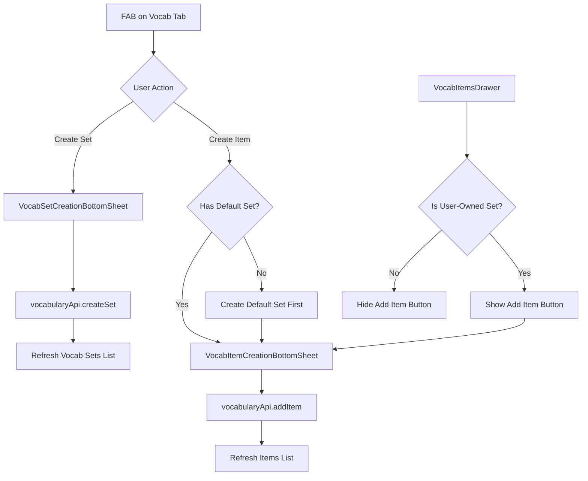
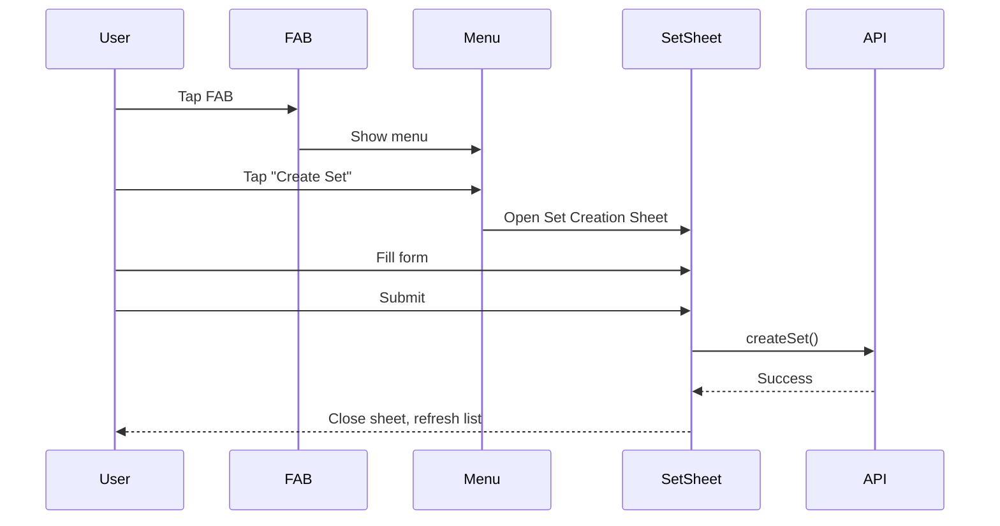
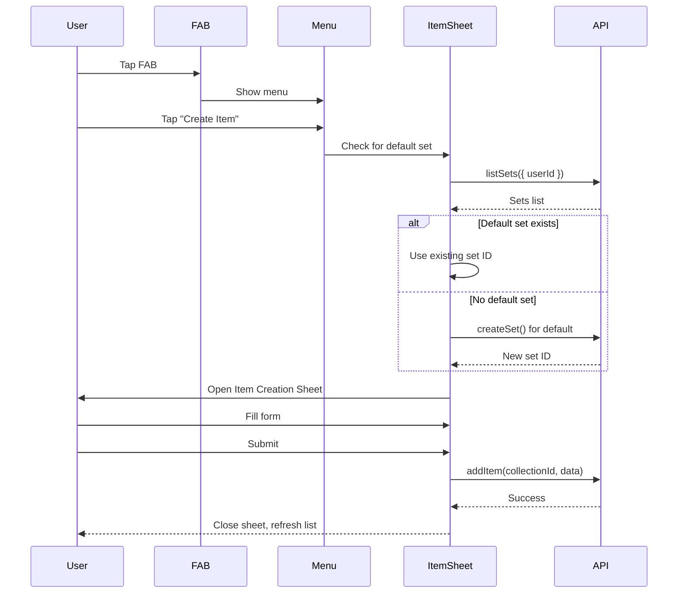
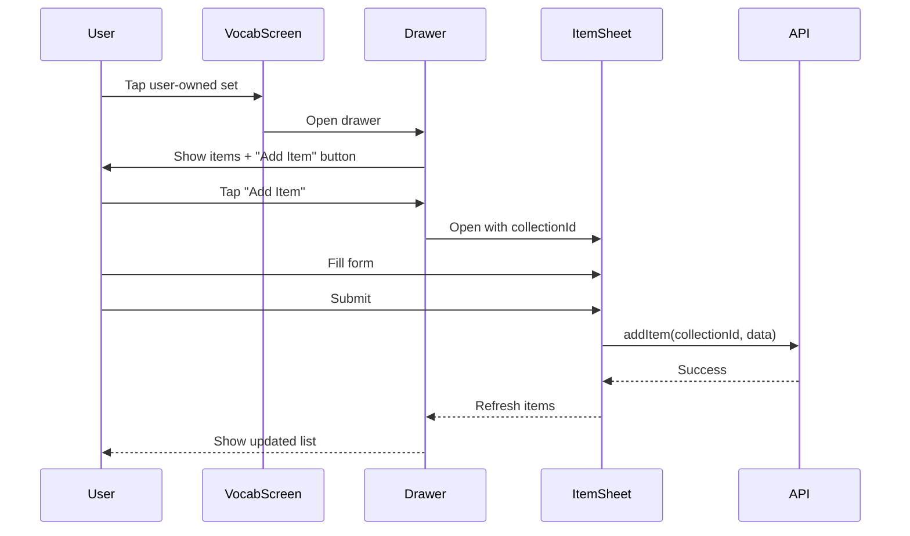

# Vocabulary Creation Feature Plan

## Overview
Implement a feature that allows users to create their own vocabulary items and vocabulary sets with two creation modes:
1. Create a vocabulary set first, then add items inside that set
2. Create vocabulary items without a set - system automatically creates a default user-specific set

## Architecture



## Components to Create

### 1. Floating Action Button (FAB) Component
**File:** `components/ui/fab.tsx`

A reusable floating action button component for primary actions.

**Props:**
- `icon`: Icon component to display
- `onPress`: Callback function
- `position`: 'bottom-right' | 'bottom-left' | 'top-right' | 'top-left'
- `size`: 'sm' | 'md' | 'lg'
- `className`: Additional styling

### 2. VocabSetCreationBottomSheet Component
**File:** `components/vocab/vocab-set-creation-bottom-sheet.tsx`

Bottom sheet form for creating a new vocabulary set.

**Props:**
- `isOpen`: Boolean to control visibility
- `onClose`: Callback when closed
- `onCreate`: Callback when set is created successfully

**Form Fields:**
- `title` (required): Text input
- `description` (optional): Text input (multiline)
- `icon` (optional): Icon selector (use IconRenderer)
- `isPublic` (optional): Switch/Toggle (default: false)

**Validation:**
- Title is required
- Title length: 1-100 characters

### 3. VocabItemCreationBottomSheet Component
**File:** `components/vocab/vocab-item-creation-bottom-sheet.tsx`

Bottom sheet form for creating a new vocabulary item.

**Props:**
- `isOpen`: Boolean to control visibility
- `onClose`: Callback when closed
- `onCreate`: Callback when item is created successfully
- `collectionId`: Optional - ID of the set to add item to (if null, uses default set)
- `userId`: Current user ID for default set creation

**Form Fields:**
- `korean` (required): Text input
- `indonesian` (required): Text input
- `type` (required): Select/Tabs - WORD | SENTENCE | IDIOM (default: WORD)
- `pos` (optional): Select - KATA_KERJA | KATA_BENDA | KATA_SIFAT | KATA_KETERANGAN
- `audioUrl` (optional): Text input
- `exampleSentences` (optional): Dynamic list of text inputs

**Validation:**
- Korean and Indonesian are required
- Type is required (default to WORD if not selected)

### 4. VocabCreationMenu Component
**File:** `components/vocab/vocab-creation-menu.tsx`

A menu that shows options to create a set or an item when FAB is pressed.

**Props:**
- `isOpen`: Boolean to control visibility
- `onClose`: Callback when closed
- `onCreateSet`: Callback to open set creation
- `onCreateItem`: Callback to open item creation

## Components to Modify

### 1. VocabItemsDrawer
**File:** `components/vocab/vocab-items-drawer.tsx`

**Changes:**
- Add `userId` prop to check ownership
- Add "Add Item" button in header when `set.userId === userId`
- Button opens `VocabItemCreationBottomSheet` with `collectionId` pre-filled

### 2. VocabScreen (vocab.tsx)
**File:** `app/(tabs)/vocab.tsx`

**Changes:**
- Add state for creation menus and bottom sheets
- Add FAB component
- Integrate `VocabCreationMenu`, `VocabSetCreationBottomSheet`, `VocabItemCreationBottomSheet`
- Add `userId` from `useAuth()` hook
- Implement default set logic:
  - Check if user has a default set (e.g., title contains "Default" or specific naming pattern)
  - If not, create default set on first item creation
  - Store default set ID in local state

### 3. components/vocab/index.ts
**File:** `components/vocab/index.ts`

**Changes:**
- Export new components: `VocabSetCreationBottomSheet`, `VocabItemCreationBottomSheet`, `VocabCreationMenu`

## API Integration

### Using vocabularyApi from hakgyo-expo-sdk

```typescript
// Create vocabulary set
const response = await vocabularyApi.createSet({
  title: 'My Custom Set',
  description: 'Optional description',
  icon: 'FaBook',
  isPublic: false,
  userId: 'user-id'
});

// Create vocabulary item
const response = await vocabularyApi.addItem(collectionId, {
  korean: '안녕하세요',
  indonesian: 'Halo',
  type: 'WORD',
  pos: 'KATA_SIFAT',
  audioUrl: 'https://example.com/audio.mp3',
  exampleSentences: ['안녕하세요!', '안녕!']
});
```

## Default Vocabulary Set Logic

When creating an item without specifying a set:

1. Check if user already has a default set by calling `vocabularyApi.listSets({ userId })`
2. Look for a set with title pattern like "My Vocab" or "Default Set" (user-specific)
3. If found, use that set's `collectionId`
4. If not found, create a new default set:
   - Title: "My Vocab" or similar
   - Description: "My personal vocabulary collection"
   - Icon: User icon
   - isPublic: false
5. Use the newly created set's ID for the item

## User Flow Diagrams

### Flow 1: Create Set First


### Flow 2: Create Item (With Default Set)


### Flow 3: Add Item to User-Owned Set


## Styling Guidelines

- Use existing UI components from `components/ui/`
- Follow NativeWind/Tailwind CSS patterns
- Use semantic color tokens: `primary`, `secondary`, `muted`, `foreground`, `background`, `border`
- Match existing design patterns from `VocabSet` and `VocabItem` components
- Use consistent spacing: `p-4`, `gap-3`, `mt-2`, `mb-4`
- Use flexbox: `flex-row`, `flex-col`, `items-center`, `justify-center`, `justify-between`

## Error Handling

- Show loading states during API calls
- Display error messages using `Alert` component
- Handle network errors gracefully
- Validate form inputs before submission
- Show success feedback after creation

## Dependencies

- `@gorhom/bottom-sheet` - Already installed
- `hakgyo-expo-sdk` - Already installed
- `lucide-react-native` - Already installed
- `react-native-reanimated` - Already installed
- `react-native-gesture-handler` - Already installed

## Testing Checklist

- [ ] FAB appears on vocab tab screen
- [ ] FAB opens creation menu
- [ ] Create Set form validates required fields
- [ ] Create Set successfully creates new set
- [ ] Create Item form validates required fields
- [ ] Create Item without set creates default set
- [ ] Create Item with existing set adds to that set
- [ ] Add Item button appears on user-owned sets
- [ ] Add Item button is hidden on non-user sets
- [ ] Lists refresh after creation
- [ ] Error messages display correctly
- [ ] Bottom sheets close properly
- [ ] Form fields reset after submission
